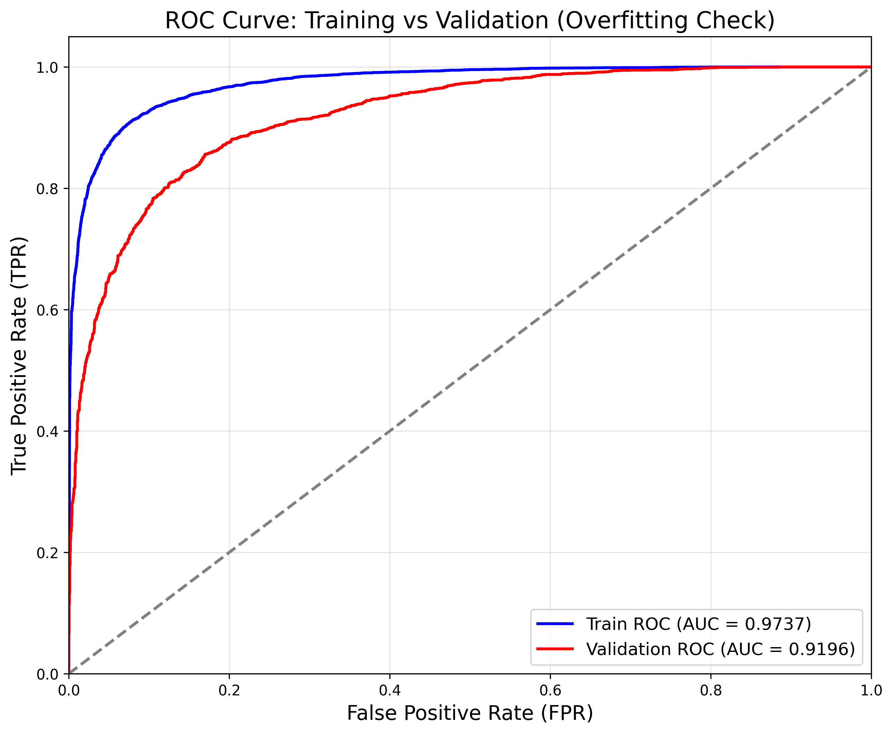
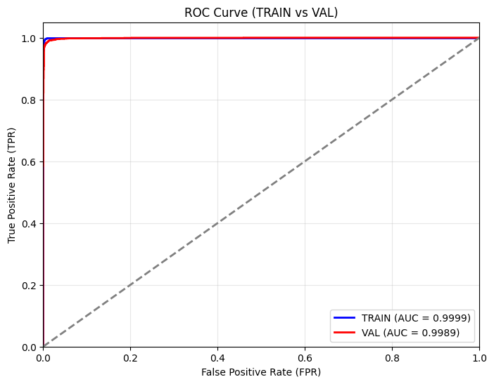

# 🐱🐶 Cat vs Dog Image Classifier (CNN & Transfer Learning)

這是一個使用 PyTorch 建立的深度學習專案，旨在透過卷積神經網路 (CNN) 準確地對貓和狗的圖片進行分類。
為了達到高準確率並解決過擬合 (Overfitting) 的問題，本專案導入了 **ResNet18** 進行遷移學習 (Transfer Learning)，並結合了多種抗過擬合的優化技術。

## ✨ 專案特色與優化技術

本專案從最初的自建 CNN 模型逐步改良，最終採用了以下技術來提升模型泛化能力：

- **遷移學習 (Transfer Learning)**：使用預訓練的 `ResNet18` 骨幹網路，大幅減少訓練時間並提升特徵擷取能力。
- **資料增強 (Data Augmentation)**：包含隨機旋轉、水平翻轉、顏色微調等，讓模型每次看到的圖片都有所不同，增加強健性。
- **L2 正規化 (Weight Decay)**：在優化器中加入權重衰減，懲罰過大的權重，防止模型過度記憶訓練集。
- **Dropout 機制**：在全連接層 (FC layer) 加入 Dropout (p=0.5)，隨機使部分神經元失活，強迫模型學習更具代表性的特徵。
- **早停機制 (Early Stopping)**：監控驗證集的 Loss 變化，當模型在數個 Epoch 內沒有進步時自動停止訓練，保存最佳權重，避免後續訓練導致過擬合。

## 📊 訓練成果與評估 (ROC 曲線比對)

為了突顯我們導入 ResNet18 遷移學習與抗過擬合技術的效果，我們將「**未修改前的自建 CNN 模型**」與「**優化後的模型**」進行了比對：

### 1. 原始模型 (未修改前)
這是我們最初自行搭建的 CNN 模型所繪製出來的 ROC 曲線。可以看出其分類能力仍有提升空間。



### 2. 優化後模型 (導入 ResNet18)
經過加入遷移學習、L2 正規化、Dropout 與 Early Stopping 等機制後，模型的表現大幅提升！ROC 曲線呈現出幾乎完美的直角，代表我們的模型擁有極高的 AUC (Area Under Curve)，分類能力極強！

*(請將您後來在 Notebook 跑出呈現直角的 ROC 圖片存檔命名為 `roc_curve_improved.png`，並放在這個資料夾下，圖片就會自動顯示在這裡囉！)*



## 📁 檔案結構

- `train_cat_dog.ipynb`：**強烈建議閱讀此檔案！** 包含完整的訓練流程、註解說明、資料視覺化、模型架構與圖表繪製。
- `train_cat_dog_improved.py` / `train_cat_dog.py`：純 Python 腳本版本的訓練程式碼。
- `cat_dog_classifier_.../`：訓練過程中自動保存的最佳模型權重。
- `roc_curve_result.png`：模型評估結果圖表。

## 🚀 如何使用

若要在本地端執行此專案，請先確保安裝了相關套件：

```bash
pip install torch torchvision matplotlib scikit-learn jupyter
```

接著啟動 Jupyter Notebook：

```bash
jupyter notebook train_cat_dog.ipynb
```

您可以直接在 Notebook 中一格一格執行，觀察訓練過程與圖表輸出！
